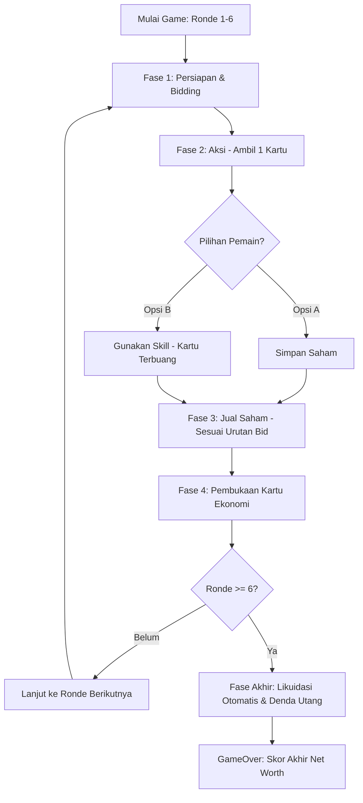

# Product Requirements Document (PRD) — StockLab
### v1.1 — MVP Simplified

---

## 1. Pendahuluan & Visi Produk

**StockLab** adalah aplikasi web simulasi pasar modal (*capital market simulation*) berbasis giliran (*turn-based*) yang dirancang untuk mengedukasi pengguna tentang dinamika perdagangan saham, manajemen portofolio, leverage keuangan (utang), dan risiko pasar. Melalui interaksi yang kompetitif melawan Bot AI, pemain belajar menyusun strategi investasi, mengelola risiko krisis ekonomi, serta mengeksplorasi instrumen keuangan secara mandiri tanpa kompleksitas sistem multi-pengguna yang rumit.

### Tujuan Utama (Scope MVP)

- **Edukasi Investasi Finansial** — Menyediakan media belajar interaktif mengenai cara kerja pasar modal, pengaruh berita ekonomi terhadap harga saham, serta dampak utang melalui simulasi langsung di peramban (*browser*).
- **Gameplay Minimalis & Responsif** — Berfokus pada fungsionalitas inti alur permainan ala *Gaffer* yang solid, cepat, menantang, dan intuitif.
- **Kemandirian Klien (No-Backend)** — Seluruh status permainan, riwayat, dan perkembangan disimpan langsung melalui `localStorage` tanpa memerlukan otentikasi server atau pendaftaran akun global (langsung main tanpa login).

> **Catatan Referensi**: Istilah "*ala Gaffer*" pada dokumen ini merujuk pada gaya *drafting card game* seperti **Gaffer XI** (draft kartu pemain bola lintas era/klub, tagline "Draft · Build · Play") — bukan referensi mekanisme finansial, melainkan referensi **gaya visual & UX kartu**: layout kartu dengan badge rating di pojok atas, header info klub/tahun (dianalogikan sektor/tipe aset di StockLab), warna gradient solid yang membedakan kategori/tim, ilustrasi/ikon di tengah kartu, garis aksen warna di bawah, dan nama besar di footer kartu. Referensi ini menjadi acuan desain UI kartu StockLab pada bagian 8.

---

## 2. Arsitektur & Spesifikasi Teknologi

Aplikasi ini dibangun menggunakan tumpukan teknologi modern sisi klien (*pure client-side*):

| Komponen | Teknologi | Keterangan |
|---|---|---|
| Frontend Framework | React (Vite) | Render UI cepat, reaktif, dan efisien |
| State Management | Zustand | Manajemen state game global dengan sinkronisasi otomatis ke `localStorage` (auto-save & resume game) |
| Styling | Tailwind CSS | Skema warna adaptif, efek glassmorphism, animasi mikro modern, dioptimalkan mobile-first |
| Font & Icon | Material Symbols Outlined | Didukung font modern seperti Inter atau Outfit |
| Data Server | Tidak ada | Pure Client-Side MVP — tanpa ketergantungan API eksternal untuk mempercepat rilis pertama |

---

## 3. Alur Permainan (Game Loop) & Struktur Fase

Setiap sesi pertandingan berlangsung selama tepat **6 Ronde**. Pengguna bertanding melawan **2 Bot AI (Wira & Citra)**. Setiap ronde terdiri dari 4 fase utama:

### 3.1 Fase Persiapan & Penawaran (Preparation & Bidding Phase)

- 6 Kartu Aksi hibrida ditarik acak dari dek utama dan diletakkan terbuka di atas meja (*Action Board*).
- Setiap pemain menentukan taruhan koin (*bid*) secara rahasia untuk memperebutkan urutan jalan (*play order*) dari modal awal (**Saldo Awal: 30 Koin**).
- Penawar tertinggi berjalan pertama. Koin yang dipertaruhkan dipotong dari saldo cash dan masuk ke Bank.

### 3.2 Fase Aksi (Action Phase)

Pemain bergantian sesuai urutan jalan untuk mengambil tepat 1 kartu dari meja:

- **Opsi A — Simpan Saham**: Membeli unit saham/reksa dana tersebut dengan membayar harga pasar saat ini. Kartu disimpan ke dalam portofolio sebagai aset. Jika koin cash tidak cukup, Bank otomatis memberikan pinjaman utang.
- **Opsi B — Gunakan Skill**: Menggunakan kemampuan khusus kartu tersebut secara gratis. Efek skill langsung dieksekusi saat itu juga, lalu kartu dibuang (*discard*). Pemain tidak mendapatkan komoditas saham dari kartu tersebut.

### 3.3 Fase Jual (Sell Phase)

- Pemain bergantian memutuskan untuk menjual instan unit saham/reksa dana yang dimiliki ke Bank dengan harga pasar saat ini untuk menambah koin tunai (cash).
- **Aturan Urutan**: Alur giliran menjual mengikuti urutan hasil bidding (pemenang bid tertinggi berhak menjual lebih dahulu) untuk memberikan keuntungan strategis mengamankan harga bursa sebelum berfluktuasi kembali.
- Pemain dapat memilih untuk menjual beberapa unit atau langsung melewati fase ini (*pass*).

### 3.4 Fase Ekonomi (Economy Phase)

- Kartu ekonomi ditarik otomatis dari dek sektor untuk menentukan perubahan harga pasar (fluktuasi positif/negatif).
- Evaluasi kondisi khusus pasar seperti pasar jenuh, *Stock Split* (batas atas), atau *Stock Crash* (batas bawah).
- Fluktuasi acak untuk Reksa Dana dihitung secara terpisah.

### 3.5 GameOver & Likuidasi

- Setelah Ronde 6 selesai, seluruh sisa portofolio pemain dilikuidasi otomatis menjadi koin tunai.
- Pengenaan denda utang dihitung berdasarkan total angka pada Debt Counter (saldo cash dipotong **15 koin** untuk setiap 1 poin utang).
- Hasil akhir (Net Worth) menentukan peringkat pemain.

---

## 4. Konfigurasi Sektor Pasar & Batasan Harga

Terdapat 4 sektor saham industri dan 1 instrumen reksa dana dengan perilaku pasar yang unik:

| Nama Sektor | Harga Awal | Harga Minimum | Harga Maksimum | Harga Crash | Fitur / Efek Khusus |
|---|---|---|---|---|---|
| Properti | 5 | 2 | 12 | 4 | **Pasar Jenuh**: Harga tertahan di batas maksimal 12 |
| Infrastruktur | 5 | 1 | 15 | 3 | **Mega Project**: Bonus +1 koin per lembar saham yang dimiliki saat menyentuh batas atas |
| Industri | 5 | 1 | 18 | 2 | **Industrial Boom**: Ronde berikutnya semua kenaikan sektor Industri mendapat bonus +1 tambahan |
| Consumer | 5 | 0 | 20 | 1 | **Consumer Frenzy**: Setelah menyentuh batas atas, harga otomatis turun (koreksi) sebesar -3 di akhir ronde |
| Reksa Dana | 10 | 8 | 18 | N/A | **Aset Aman**: Tidak mengalami Split/Crash. Berfluktuasi acak setiap akhir ronde sebesar [+1, +2, -1, 0]. Bisa diperjualbelikan secara normal di Fase Jual |

> **Catatan**: Kolom Harga Awal / Minimum / Maksimum / Crash di atas direkonstruksi dari tabel sumber yang formatnya rusak (kolom tergabung tanpa pemisah). Mohon **diverifikasi ulang** angka-angka ini terhadap dokumen asli sebelum dipakai sebagai acuan final development, khususnya untuk sektor Properti, Infrastruktur, Industri, dan Consumer.

---

## 5. Mekanisme Krisis Pasar (Split & Crash)

Dua fenomena ekstrem pasar disimulasikan untuk menguji ketahanan portofolio pemain:

### A. Stock Split (Batas Atas)

**Kondisi**: Ketika harga suatu sektor saham naik mencapai atau melebihi Harga Maksimum setelah fase ekonomi.

**Eksekusi**:
- Harga pasar saham sektor tersebut langsung dipotong setengahnya: `Harga Baru = Floor(Harga Maksimum / 2)`.
- Jumlah saham sektor tersebut di portofolio seluruh pemain dilipatgandakan menjadi dua kali lipat (2x).
- Memicu notifikasi pop-up dan mencatat kejadian pada log aktivitas bursa.

### B. Stock Crash (Batas Bawah)

**Kondisi**: Ketika harga suatu sektor saham turun mencapai atau di bawah Harga Minimum setelah fase ekonomi.

**Eksekusi**:
- Seluruh kepemilikan saham sektor tersebut di portofolio seluruh pemain langsung hangus dan diset menjadi 0.
- Harga pasar saham diset ulang ke Harga Crash dasar yang telah ditentukan (sebagai batas bawah pemulihan bursa).
- Memicu notifikasi pop-up peringatan merah dan mencatat kejatuhan pasar pada log aktivitas.

---

## 6. Pembaruan Sistem Kartu & Mekanisme Leverage

### A. Konsep Kartu Hibrida (Sektor + Skill)

Tidak ada dek terpisah antara kartu saham dan kartu skill. Setiap kartu yang muncul di Action Board mewakili satu instrumen komoditas (4 Sektor Industri atau 1 Reksa Dana) yang ditempeli secara acak (*random pool*) oleh 1 dari 5 kemampuan skill berikut:

| Skill | Efek |
|---|---|
| **Info Bursa** | Mengintip kartu ekonomi teratas dari 2 sektor pasar berikutnya dan memperoleh bantuan likuiditas dari Bank sebesar +2 koin |
| **Rumor** | Memanipulasi pasar dengan menaikkan atau menurunkan harga saham sektor terpilih sebesar +/- 2 poin (diaplikasikan via 2x klik interaktif masing-masing +/- 1 poin) |
| **Quick Buy** | Menarik 2 kartu saham secara acak dari dek utama secara gratis dan langsung mengakhiri giliran aksi pemain yang bersangkutan |
| **Trading Fee** | Menjual saham sektor tertentu secara instan pada Fase Aksi dengan potongan biaya transaksi flat sebesar -1 koin per lembar saham yang dijual |
| **Akuisisi** | Mencuri 1 unit saham sektor tertentu dari pemain lain (Bot/User), dengan syarat kepemilikan saham sektor tersebut milik pelaku harus >= milik korban. Bank membayar ganti rugi sebesar harga pasar saham tersebut kepada korban |

### B. Mekanisme Utang Sederhana (Debt Counter)

Kartu utang tidak direpresentasikan sebagai bentuk fisik atau kartu visual di portofolio agar hemat ruang UI dan menyederhanakan implementasi.

- **Sistem Pencatatan**: Diimplementasikan sebagai indikator angka numerik atau status badge (contoh: 🔴 Utang: 3) pada panel status keuangan pemain.
- **Aturan Kredit**: Jika harga saham yang dibeli melebihi saldo koin tunai pemain, saldo koin akan dikurangi. Setiap kali saldo koin bernilai negatif (< 0), Bank akan otomatis menambahkan +10 koin cash dan memberikan nilai +1 pada Debt Counter. Proses ini berulang hingga saldo cash kembali bernilai positif (>= 0).
- **Implikasi GameOver**: Di akhir Ronde 6, sisa total angka utang dihitung dan dikenakan denda pelunasan sebesar 15 koin per poin utang untuk memotong total Net Worth akhir.

### C. Aturan Eksekusi Skill

Klarifikasi tambahan atas mekanisme 5 skill di atas:

1. **Target sektor bebas**: Untuk skill yang membutuhkan target sektor (Rumor, Trading Fee, Akuisisi), pemain **bebas memilih sektor mana saja** sebagai target — tidak terikat pada sektor komoditas yang tertera di kartu itu sendiri. UI perlu menyediakan selector sektor saat skill ini dieksekusi.
2. **Trading Fee — syarat kepemilikan**: Skill ini hanya bisa dipilih jika pemain **memiliki saham sektor target**. Jika pemain tidak memiliki saham sektor manapun yang bisa dijual, opsi Trading Fee tidak dapat dipilih (di-disable di UI).
3. **Akuisisi — penentuan korban saat lebih dari satu memenuhi syarat**: Jika lebih dari satu lawan (Bot/pemain lain) memenuhi syarat kepemilikan (>= milik pelaku) pada sektor target, **pemain yang mengeksekusi skill memilih sendiri korbannya** melalui UI (bukan otomatis).
4. **Quick Buy — sumber kartu**: 2 kartu diambil dari **sisa kartu yang sedang terbuka di Action Board** (bukan dek tertutup terpisah). Kedua kartu otomatis masuk ke portofolio pemain sebagai aset (tanpa keputusan simpan/skill lagi) dan giliran aksi pemain tersebut langsung berakhir.
   - **Syarat minimum**: Quick Buy butuh 2 kartu tersedia di board. Jika kartu yang tersisa di meja saat itu **kurang dari 2**, opsi Quick Buy tidak dapat dipilih.
   - **Efek berantai ke Fase Aksi**: Karena kartu diambil dari Action Board, jika Quick Buy menghabiskan seluruh sisa kartu di meja, **Fase Aksi ronde tersebut berakhir untuk semua pemain** (tidak ada kartu tersisa untuk giliran berikutnya), dan permainan lanjut ke Fase Jual seperti biasa.
   - **Pemain yang belum kebagian giliran**: Jika board habis sebelum giliran mereka tiba, pemain tersebut **tidak mendapat kartu sama sekali** di ronde itu (dianggap pass otomatis, tanpa kompensasi koin atau aset). Ini merupakan risiko strategis yang wajar dari urutan bid — pemain dengan bid rendah/urutan jalan belakangan menanggung risiko kehabisan kartu akibat Quick Buy pemain lain.
5. **Giliran otomatis berpindah setelah Opsi B**: Setiap kali pemain memilih Opsi B (gunakan skill apapun, bukan hanya Quick Buy), kartu dibuang dan giliran aksi otomatis berpindah ke pemain berikutnya sesuai urutan bid.

---

## 7. Logika Kecerdasan Buatan (Bot AI Behavior)

Permainan menyediakan lawan komputer (Wira dan Citra) dengan kecerdasan simulasi pasar berbasis aturan (*rule-based AI*):

**Fase Bidding**: Bot AI bertaruh secara dinamis dan acak antara 10%–35% dari sisa saldo koin cash mereka untuk mengamankan urutan jalan.

**Fase Aksi (Action Decision Tree)**:
1. **Prioritas 1**: Jika koin Bot sangat tipis (< 10) dan ada kartu dengan skill Quick Buy di meja, Bot akan memprioritaskannya untuk mendapatkan 2 aset gratis.
2. **Prioritas 2**: Bot mencari kartu saham murah di meja yang harganya <= 6 koin dan koin mereka mencukupi untuk membelinya.
3. **Prioritas 3**: Jika terdapat kartu dengan skill Trading Fee, dan Bot memiliki >= 2 saham pada sektor dengan harga premium (>= 8), Bot akan memilih opsi menggunakan skill untuk menjualnya instan demi mengambil keuntungan.
4. **Prioritas 4 (Fallback)**: Bot memilih kartu sisa di meja secara acak. Jika memilih opsi simpan saham, mereka membelinya (meski harus berutang); jika memilih opsi skill, mereka langsung mengeksekusinya.

**Fase Jual**: Bot AI hanya akan melikuidasi portofolio mereka jika harga pasar suatu sektor dinilai sangat menguntungkan (harga >= 12). Jika tidak ada sektor yang memenuhi kriteria, mereka memilih *pass*.

---

## 8. Fitur UI Utama & Pengalaman Pengguna (UX) — Terpangkas

Untuk menjaga kesederhanaan model *Gaffer*, beberapa modul UI dipangkas atau dijadikan representasi statis:

- **Splash Screen**: Animasi loader sederhana sebelum tombol "Mulai" muncul.
- **Bento Grid Main Menu**: Navigasi minimalis modern menggunakan struktur grid bento untuk menyajikan pilihan menu (langsung menuju tombol Play atau Tutorial).
- **Lobby Virtual**: Placeholder UI statis/lokal (tanpa sinkronisasi kode PIN multiplayer online).
- **Panel Trading Dashboard**: Menyajikan status round, tren pergerakan grafik mini (*price history sparkline*), dashboard portofolio pemain secara real-time, panel log bursa yang bisa di-scroll, panel kartu aksi interaktif, serta Debt Counter berwarna merah kontras di dekat saldo kas pemain.
- **Dialog Modal & Peringatan**: Pop-up khusus saat krisis pasar (Split/Crash), dialog konfirmasi keluar match, serta modal penjelasan detail kartu aksi.

### Spesifikasi Visual Kartu Aksi (Referensi Gaffer XI)

Desain kartu aksi (Action Board & portofolio) mengadaptasi gaya visual *drafting card* seperti **Gaffer XI**, dengan pemetaan elemen sebagai berikut:

| Elemen Kartu Gaffer XI | Adaptasi di StockLab |
|---|---|
| Badge rating (angka besar, pojok kiri atas, dengan ikon perisai) | **Badge harga saat ini** (angka koin, pojok kiri atas) |
| Header info klub & tahun (contoh: "AJAX '1972") | **Header sektor & fase harga** (contoh: "PROPERTI · Ronde 3") |
| Ikon/silhouette pemain di tengah kartu | **Ikon representatif sektor** di tengah kartu (properti, infrastruktur, industri, consumer, reksa dana — masing-masing dengan ikon unik dari Material Symbols) |
| Warna gradient solid per kartu (merah, biru, dsb — biasanya dikaitkan klub) | **Warna gradient solid per sektor**, konsisten di seluruh UI (misal: Properti = amber, Infrastruktur = biru, Industri = abu-baja, Consumer = hijau, Reksa Dana = ungu/netral) |
| Tag posisi pemain (pojok kanan bawah, contoh "CAM / ST") | **Tag skill kartu** (pojok kanan bawah — Info Bursa, Rumor, Quick Buy, Trading Fee, atau Akuisisi), dengan ikon kecil berbeda per skill |
| Garis aksen warna tipis di bawah nama | **Garis aksen status**: hijau jika harga naik ronde sebelumnya, merah jika turun, abu-abu jika stagnan |
| Nama besar di footer kartu | **Nama sektor besar di footer kartu** (contoh: "PROPERTI") |
| Efek kartu "special/rare" (border emas, glow) untuk kartu langka | **Efek highlight** untuk kartu dengan kondisi pasar ekstrem: border emas + glow halus saat harga mendekati batas Stock Split, border merah pulsing saat mendekati batas Stock Crash |

**Interaksi kartu di Action Board**:
- Kartu tersusun sedikit *fan/overlap* seperti tampilan hero Gaffer XI (bukan grid kaku), dengan efek *hover* mengangkat kartu (translateY + shadow) untuk menandakan kartu bisa diklik/dipilih.
- Saat kartu dipilih untuk Fase Aksi, tampilkan modal pop-up membesar (*flip/zoom* dari posisi kartu asli) yang menampilkan detail harga, sektor, dan skill sebelum konfirmasi Opsi A/B.
- Kartu di portofolio pemain ditampilkan dalam ukuran lebih kecil (mini-card / stack per sektor) pada panel Trading Dashboard, cukup menunjukkan badge harga terkini dan jumlah lembar yang dimiliki.
